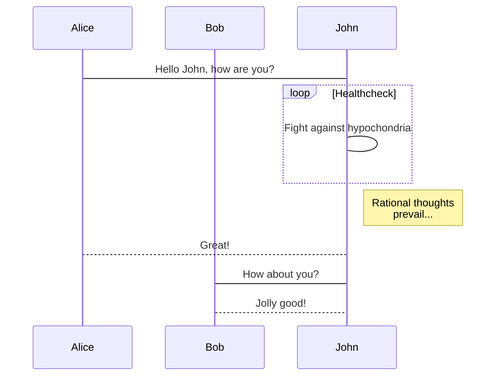

# Welcome to MWeb  -ctrl + 1 (1级标题)

MWeb is a professional Markdown writing, note taking, and static blog generator app for Mac, iPad, and iPhone. Here are some special features of MWeb.

## The software

* Made with supporting native technologies in mind. It is always a perfect integration with the platform.
  - the second title
      - the third title
* Aiming for modern UI and high performance, also being powerful, easy-to-use, and fully-featured.

## Markdown

### The powerful syntax

* Use the GitHub Flavored Markdown (GFM) by default.
* Included with the support of creating tables, TOCs, LaTeX math, fenced code blocks, task lists, footnotes, and many more.
* Easily generate graphics with any of mermaid, Graphviz, ECharts, PlantUML, js-sequence-diagrams, and flowchart.js.

### Editing assistant

* Gracefully handle image insertion: direct copy and paste, drag and drop, and full-colored preview in the editor.
* Specify the image size in Markdown-compatible syntax.
* Inserting tables and LaTeX equations with ease.

### Note taking

* Store and manage all documents in a tree-like categoring library with a tagging system. Categories can be gracefully exported or turned into static websites.
* Put quick notes.
* Instantly search from the entire library.

### Output

* Exporting contents as various formats, including HTML, EPUB, PDF, RTF, Docx, and even image.
* Publishing the articles to Wordpress, Metaweblog API, Wordpress.com, Evernote, Blogger, Medium, Ghost, and Tumblr.
* Smooth support for image upload services: using Imgur, SM.MS, Qiniu, Upyun, Tencent Cloud COS, Aliyun OSS or your custom API.

### External documentation

* There is an external mode in MWeb that enables importing existing markdown files in directories. It also handles contents from Gitbook, JekyII and Hexo.

## MWeb official help

Before use MWeb, we suggest that reading the MWeb official help document: <https://www.mweb.im/help.html> first. 
If you use the Library Mode, please check out this link <https://www.mweb.im/mweb-library.html> first. 

## Help us to make MWeb better!

1. Spread the words! Tell your friends about MWeb if you like it.
   - the second title.
2. Send Feedback: <coderforart+2333@gmail.com>
3. Leave a review or at least a rating in the Mac App Store.


## GFM syntax guide

### Newlines

End a line with two or more spaces + enter.
Just typing enter to newline,please go to Settings and enable "Translate newlines to `<br>` tags" ( default is enable ).

### Task lists

**Example:**

```
- [ ] task one not finish `- + SPACE + [ ]`
- [x] task two finished `- + SPACE + [x]`
```

**Result:**

- [ ] task one not finish `- + SPACE + [ ]`
- [x] task two finished `- + SPACE + [x]`

### Image size and alignment **(Only in MWeb)**

Setting image width, For example: ``, -w450 mean set the image width: 450.


### Multi-line code

**Example:**

	```js
	function fancyAlert(arg) {
	  if(arg) {
	    $.facebox({div:'#foo'})
	  }
	
	}
	```

**Result:**

```js
function fancyAlert(arg) {
  if(arg) {
    $.facebox({div:'#foo'})
  }

}
```

### Tables

**Example:**

```
First Header | Second Header
------------ | -------------
Content from cell 1 | Content from cell 2
Content in the first column | Content in the second column
```

You can create tables by assembling a list of words and dividing them with hyphens - (for the first row), and then separating each column with a pipe |:

**Result:**

First Header | Second Header
------------ | -------------
Content from cell 1 | Content from cell 2
Content in the first column | Content in the second column


### Strikethrough

**Example:**

	 (like ~~this~~)

**Result:**

Any word wrapped with two tildes (like ~~this~~) will appear crossed out.

### LaTeX

Markdown syntax:

    Block-level formula:
    ```math
    x = \dfrac{-b \pm \sqrt{b^2-4ac}}{2a}
    ```
    
    In-line formula: ``\Gamma(n) = (n-1)!\quad\forall n\in\mathbb N``


The resut is (enable LaTeX in the settings page):

Block-level formula:

```math
x = \dfrac{-b \pm \sqrt{b^2-4ac}}{2a}
```

In-line formula: ``\Gamma(n) = (n-1)!\quad\forall n\in\mathbb N``

Note: For compatibility with MWeb 3, $\Gamma(n) = (n-1)!\quad\forall n\in\mathbb N$ is also supported
And block-level syntax
$$ x = \dfrac{-b \pm \sqrt{b^2-4ac}}{2a} $$
But it is recommended to use the new syntax.

## MWeb drawing

### mermaid

mermaid is a popular drawing gallery. It supports flowcharts, sequence diagrams and Gantt charts. Its official website is: <https://mermaidjs.github.io/>. The syntax of mermaid in MWeb is to declare code blocks. The language is mermaid, and the mermaid drawing grammar can be written in the code block. You can copy the following grammar to MWeb to view the result.

    ```mermaid
    sequenceDiagram
        participant Alice
        participant Bob
        Alice->John: Hello John, how are you?
        loop Healthcheck
            John->John: Fight against hypochondria
        end
        Note right of John: Rational thoughts <br/>prevail...
        John-->Alice: Great!
        John->Bob: How about you?
        Bob-->John: Jolly good!
    ```

**The result is:**


### echarts

echarts is a js drawing gallery produced by Baidu. Its website is: <https://echarts.apache.org/zh/index.html>. It has very powerful functions. MWeb supports some basic usages of echarts, but not too advanced. . You can copy the following syntax to MWeb to try. You can also go to <https://echarts.apache.org/examples/zh/index.html> to view some examples. Note that MWeb can only parse the simple `option = {}`, but it should It is enough to use.

    ```echarts
    option = {
        xAxis: {
            type:'category',
            data: ['Mon','Tue','Wed','Thu','Fri','Sat','Sun']
        },
        yAxis: {
            type:'value'
        },
        series: [{
            data: [820, 932, 901, 934, 1290, 1330, 1320],
            type:'line'
        }]
    };
    ```

**The result is:**

```echarts
option = {
    xAxis: {
        type:'category',
        data: ['Mon','Tue','Wed','Thu','Fri','Sat','Sun']
    },
    yAxis: {
        type:'value'
    },
    series: [{
        data: [820, 932, 901, 934, 1290, 1330, 1320],
        type:'line'
    }]
};
```

### Footnote

**Example:**

```
This is a footnote:[^1]
```

**Result:**

This is a footnote:[^1]

[^1]: footnote text detail...

### Comment And Read More..

<!-- comment -->
<!-- more -->


### FlowChat

Using flowchat.js

Input flow at language selete.

`st`  variable declaration

`start` type assign

`建立连接` display content

Reference: https://blog.csdn.net/qq_41725131/article/details/125771292?spm=1001.2101.3001.6650.5&utm_medium=distribute.pc_relevant.none-task-blog-2%7Edefault%7EBlogCommendFromBaidu%7ERate-5-125771292-blog-90644019.pc_relevant_multi_platform_whitelistv3&depth_1-utm_source=distribute.pc_relevant.none-task-blog-2%7Edefault%7EBlogCommendFromBaidu%7ERate-5-125771292-blog-90644019.pc_relevant_multi_platform_whitelistv3&utm_relevant_index=10

##### sample:

```flow
st=>start: 建立连接
op1=>operation: 查询缓存
cond1=>condition: 是否命中
op2=>operation: 未命中
op3=>operation: 命中
op3=>operation: 返回结果
op4=>operation: 检查语法
cond2=>condition: 是否正确
oper1=>operation: 报错
oper2=>operation: 报错
op5=>operation: 解析SQL
op6=>operation: 生成解析树
cond3=>condition: 验证通过
op7=>operation: 生成执行计划
op8=>operation: 调用一个具体的存储引擎
op9=>end: 访问存储层获取数据

st->op1->cond1
cond1(no)->op2
cond1(yes)->op3
op2->op4
op4->cond2
cond2(no)->oper1
cond2(yes)->op5
op5->op6
op6->cond3
cond3(no)->oper2
cond3(yes)->op7
op7->op8
op8->op9

```
##### Sample2:
```flow
st=>start: 开始框
op=>operation: 处理框
op1=>operation: 处理框
op2=>operation: 处理框
op3=>operation: 处理框
cond=>condition: 判断框(是或否?)
para=>parallel: 并行任务
e1=>end: 结束框
e2=>end: 结束框
st->op->cond
cond(yes,bottom)->para
para(path1, right)->op1->e1
para(path2, left)->op2->e1
para(path3, bottom)->op3->e1
cond(no)->e2

```

#### Sample3:

```flow
st=>start: 开始框
op=>operation: 处理框
cond=>condition: 判断框(是或否?)
sub=>subroutine: 子流程
io=>inputoutput: 输入输出框
e=>end: 结束框
st->op->cond
cond(yes,bottom)->io->e
cond(no,left)->sub(top)->op

```

